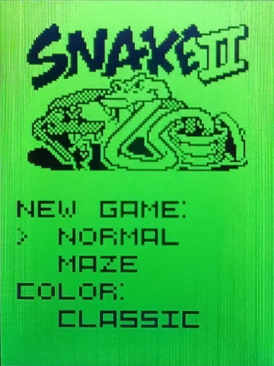
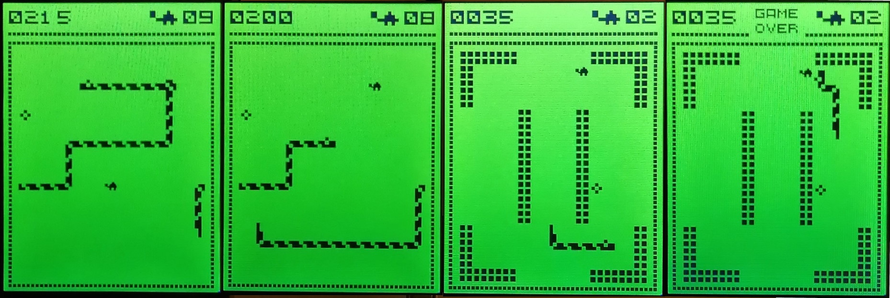
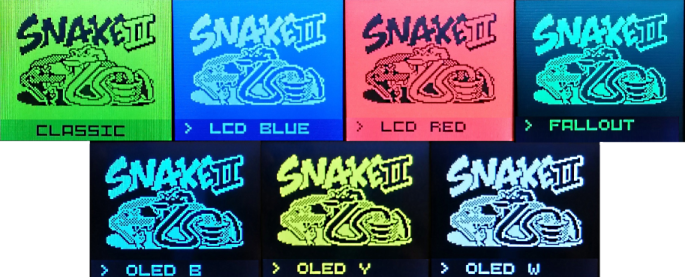

# Snake на STM32 (HAL)
Практически полный ремейк классической змейки.  
В проекте была использована [отладочная плата NUCLEO-F767ZI](https://www.chipdip.ru/product/nucleo-f767zi-2) на базе STM32F767ZIT6.  

## Геймплей
  

Цель игры - набрать как можно больше очков.  
На игровом поле в случайных местах появляются еда и черепашки. При съедании пищи инкрементируется счет, увеличивается длина змейки и поднимается скорость движения. Контакт с телом змейки или со стеной лабиринта приводит к концу игры.  

Управление стиком:
* В меню вверх/вниз - навигация, вправо - выбор
* В игре вверх/вниз/влево/вправо - управление змейкой  

## Темы  
  

На выбор игрока есть семь цветовых тем:
* Классический
* LCD Синий
* LCD Красный
* OLED Синий
* OLED Желтый
* OLED Белый
* Fallout